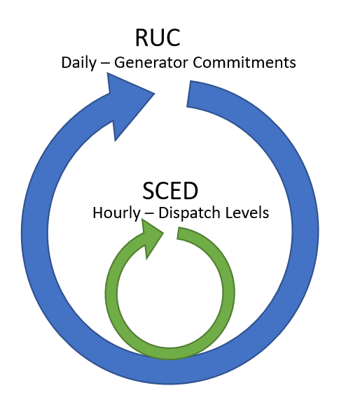

The Prescient Simulation Cycle
==============================

Prescient simulates the operation of a power generation network throughout a
study horizon, finding the set of operational choices that satisfy demand at
the lowest possible cost.

A Prescient simulation consists of two repeating cycles, one nested in the
other. The outer cycle is the Reliability Unit Commitment (RUC) planning
cycle, which schedules changes in dispatchable generators' online status during
the cycle's period. The inner, more frequent cycle is the Security Constrained
Economic Dispatch (SCED) cycle, which determines dispatch levels for
dispatchable generators.

The RUC Cycle
-------------

The RUC cycle periodically generates a RUC plan. A RUC plan consists of two types of
data: a unit commitment schedule and, optionally, a pricing schedule (when
:ref:`compute-market-settlements<config_compute-market-settlements>` is True).
The unit commitment schedule
indicates which dispatchable generators should be activated or deactivated during
upcoming time periods. The pricing schedule sets the contract price for expected power
delivery and for reserves (ancillary service products).
The RUC plan reflects the least expensive
way to satisfy predicted loads while honoring system constraints.

A new RUC plan is generated at regular intervals, at least once per day. A new
RUC plan always goes into effect at midnight of each day. If more than one
RUC plan is generated each day, then additional RUC plans take effect at equally
spaced intervals. For example, if 3 RUC plans are generated each day, then one
will go into effect at midnight, one at 8:00 a.m., and one at 4:00 p.m. Each
RUC plan covers the time period that starts when it goes into effect and ends
just as the next RUC plan becomes active.

A RUC plan is based on the current state of the system at the time the plan is
generated (particularly the current dispatch and up- or down-time for dispatchable
generators), and on forecasts for a number of upcoming time periods. The forecasts
considered when forming a RUC typically extend beyond the end of the RUC's planning
period, to avoid poor choices at the end of the plan ("end effects").

The simulation can be configured to generate RUC plans some number of hours before
they take effect. Each RUC plan still covers
the expected time period, from the time the plan takes effect until the next RUC plan
takes effect, but its decisions will be based on what is known at the time the RUC
plan is generated.

More information about RUCs is found in :doc:`../reference/ruc_details`.

The SCED Cycle
--------------

The SCED process selects dispatch levels for all active dispatchable generators
in the current simulation time period. Dispatch levels are determined using a process
that is very similar to that used to build a RUC plan. The current state of the
system, together with forecasts for a number of future time periods, are examined to
select dispatch levels that satisfy current loads and forecasted future loads at the
lowest possible cost.

The SCED cycle is more frequent than the RUC cycle, with new dispatch levels selected
at least once an hour. The SCED honors unit commitment decisions made in the RUC plan;
whether each generator is committed or not is dictatated by the RUC schedule
currently in effect.

Costs are determined with each SCED, based on dispatchable generation levels selected by
the SCED process, commitment and start-up decisions selected by the active RUC
plan, and actual demands and non-dispatchable generation levels for the current simulation
time. If market settlement is enabled, market-based generator revenue is also calculated.

More information about SCEDs is found in :doc:`../reference/sced_details`.

.. seealso::

   A more detailed description of the Prescient simulation process can be found
   in the :doc:`../reference/detailed_lifecycle` documentation.

   More information about RUCs and SCEDs is available from
   :doc:`../reference/ruc_details` and :doc:`../reference/sced_details`.
