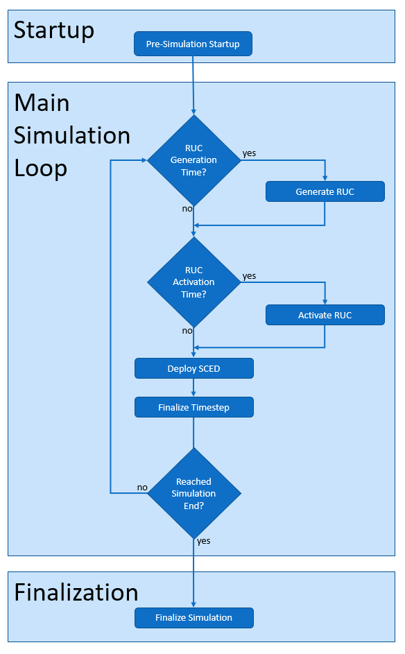

Detailed Prescient Simulation Lifecycle
=======================================

As Prescient simulates the operation of a power generation network, the simulation
follows a repeating cycle of Reliability Unit Commitment (RUC) plans and Security
Constrained Economic Dispatch (SCED) plans. This cycle is described at a high level
in the concepts section (see :doc:`../concepts/ruc_sced_cycle`). This page
provides a more detailed description of the simulation process, including plugin
points that provide opportunities for custom code to observe or modify the
simulation.

A Prescient simulation consists of three phases: startup, the main simulation
loop, and finalization. Each phase includes one or more tasks that are executed
in a specific order. In the case of the main simulation loop, these tasks are
carried out multiple times, once per SCED during the simulation period.

The Prescient simulation lifecycle is executed when you run the Prescient
command-line application, or in code when the `simulate()` method is called on
a `prescient.simulator.Prescient` object.

Startup
------------------

The startup phase consists of one-time activities that occur before the main
simulation loop begins.

Pre-Simulation Startup
......................

During the pre-simulation startup task, Prescient carries out activities such
as parsing options, initializing plugins, and setting up data structures.

First, any plugins specified in the simulation configuration are given an
opportunity to register their callbacks. See :ref:`Identifying Plugins` and 
:ref:`Plugin Module Initialization`.

After plugins have been initialized, two plugin callbacks are called: 

  * :ref:`plugin-options_preview`
  * :ref:`plugin-initialization`

After callbacks have been called, the current simulation time is set to midnight of
the :ref:`simulation start date<config_start-date>`.

The Main Simulation Loop
------------------------

The main simulation loop is executed once for every simulation time step, where
the simulation time step duration is the 
:ref:`SCED frequency<config_sced-frequency-minutes>`. The first simulation time
step occurs at midnight of the first day (midnight is the beginning of the day,
not the end). The last simulation time step occurs at the end of the final day
of the simulation, just before midnight of the next day.

A SCED is solved every time through the loop. Some times through the loop, a RUC may
also be generated and/or activated.

.. _Generate RUC:

Generate RUC
............

If the current simulation time is a RUC generation hour, a new RUC is generated.
This is either the same timestep the RUC will be activated, or an earlier
timestep if a RUC delay has been specified. See :doc:`ruc_details` for information on the
timing and frequency of RUC generation and its relationship to RUC activation.

Note that the initial RUC is always generated on the first timestep of the
simulation, even if Prescient has been configured to generate other RUCs earlier
than they are activated.

If a RUC is generated before its activation time, the first step of the RUC
generation process is to solve a SCED-like model to estimate what the state of the
system will be at the RUC activation time. Solving this model causes a single
callback to be called:

  * :ref:`plugin-after_get_initial_model_for_sced`

This callback is only called if the RUC is generated in a different timestep than
the RUC will be activated. The initial RUC never triggers this callback.

As part of the RUC generation process, forecasts and actual values for upcoming
periods are retrieved from the data source and loaded into Egret model. The
callbacks listed below are called as a new batch of values is about to be loaded,
giving plugins an opportunity to load any custom data they may need:

  * :ref:`plugin-after_get_initial_model_for_simulation_actuals`
  * :ref:`plugin-after_get_initial_model_for_ruc`

Finally, the RUC itself is generated and solved. The following callbacks will be
called:

  * :ref:`plugin-before_ruc_solve`
  * :ref:`plugin-after_ruc_generation`

.. _Activate RUC:

Activate RUC
............

If the current simulation time is a RUC activation time, the most recently
generated RUC will be activated. Activating a RUC simply marks the point in the
simulation when the RUC's decisions first begin to be followed. RUC activation
hours occur at regular intervals starting at midnight of the first day and repeating
at the :ref:`RUC frequency<config_ruc-every-hours>` for the rest of the simulation.
See :doc:`ruc_details` for information on the timing and frequency of RUC
activation.

The following callback is called each time a RUC is activated:

  * :ref:`plugin-after_ruc_activation`

.. _Deploy SCED:

Deploy SCED
...........

A SCED is generated, solved, and applied every simulation timestep.
When a SCED is applied, generator setpoints are set for the current simulation time.
See :doc:`sced_details`.

The following callbacks are called each time a SCED is deployed:

  * :ref:`plugin-after_get_initial_model_for_sced`
  * :ref:`plugin-before_operations_solve`
  * :ref:`plugin-after_operations`
  * :ref:`plugin-update_operations_stats`

.. _Finalize Timestep:

Finalize Timestep
.................

After SCED deployment is complete, statistics for the timestep are published
and the simulation clock advances to the time of the next SCED, as determined
by the :ref:`SCED frequency<config_sced-frequency-minutes>`.

Several callbacks related to statistics may be called at this time. Calling a
callback related to statistics is referred to as "publishing" statistics.

Operations statistics (statistics about SCED results) are published every timestep
by calling the following callback:

  * :ref:`plugin-operations_stats`

If the timestep is the final timestep in a given hour, hourly statistics are
published:

  * :ref:`plugin-hourly_stats`

If the timestep is the final timestep in a given day, daily statistics are
published:

  * :ref:`plugin-daily_stats`

The simulation clock is advanced after all relevant statistics have been published.
If the new time is later than the simulation end date, the main simulation loop
ends and Prescient moves to the Finalization stage. Otherwise Prescient repeats the
main simulation loop for the new timestep.

Finalization
------------

The finalization phase consists of tasks that occur once at the end of the
simulation.

Finalize Simulation
...................

Statistics for the simulation as a whole are published during finalization:

  * :ref:`plugin-overall_stats`

Another callback is called to notify callbacks that the simulation is complete,
giving plugins a chance to cleanly shut down:

  * :ref:`plugin-finalization`
