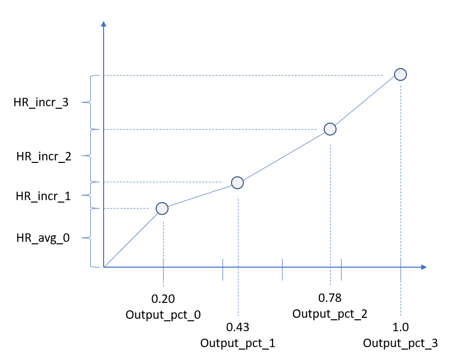

gen.csv
-------

This file is where generators are defined. Add one row for each
generator in the model, including both thermal and renewable generators.

.. list-table:: gen.csv Columns
   :header-rows: 1

   * - **Column Name**
     - **Description**
     - **Egret**
   * - :col:`GEN UID`
     - A unique string identifier for the generator.
     - Used as the branch name in Egret. Data for this branch is stored in a
       generator dictionary stored at :samp:`['elements']['generator'][{<GEN UID>}]`.
   * - :col:`Bus ID`
     - :col:`Bus ID` of connecting bus
     - The :col:`Bus Name` of the bus with the matching :col:`Bus ID`, as entered in
       bus.csv, is stored in the Egret generator dictionary as ``bus``.
   * - :col:`Unit Type`
     - The kind of generator
     - Typically stored in ``unit_type``. Has additional side effects. See
       `Generator Types`_ below.
   * - :col:`Fuel`
     - The type of fuel used by the generator
     - Stored in the generator dictionary as ``fuel``
   * - :col:`MW Inj`
     - Real power injection setpoint
     - Stored in the generator dictionary as ``pg``
   * - :col:`MVAR Inj`
     - Reactive power injection setpoint
     - Stored in the generator dictionary as ``qg``
   * - :col:`PMin MW`
     - Minimum stable real power injection
     - May be left blank. If present, stored in the generator dictionary in
       multiple places: ``p_min``, ``startup_capacity``, ``shutdown_capacity``,
       and ``p_min_agc``
   * - :col:`PMax MW`
     - Maximum stable real power injection
     - May be left blank. If present, stored in the generator dictionary in
       multiple places: ``p_max`` and ``p_max_agc``
   * - :col:`QMin MVAR`
     - Minimum stable reactive power injection
     - May be left blank. If present, stored in the generator dictionary as
       ``q_min``
   * - :col:`QMax MVAR`
     - Maximum stable reactive power injection
     - May be left blank. If present, stored in the generator dictionary as
       ``q_max``
   * - :col:`Ramp Rate MW/Min`
     - Maximum ramp up and ramp down rate
     - Thermal generators only. May be left blank. If present, stored in the
       generator dictionary in multiple places: ``ramp_q`` and ``ramp_agc``
   * - :col:`Output_pct_0` through :col:`Output_pct_<N>`
     - The fraction of :col:`PMax MW` for fuel curve point *i* (See `Fuel Curves`_ below).
     - Thermal generators only. See `Fuel Curves`_ below.
   * - :col:`HR_avg_0`
     - Average heat rate between 0 and the first fuel curve point, in BTU/kWh
     - Thermal generators only. See `Fuel Curves`_ below.
   * - :col:`HR_incr_1` through :col:`HR_incr_<N>`
     - Additional heat rate between fuel curve point *i-1* and fuel curve point
       *i*, in BTU/kWh.
     - Thermal generators only. See `Fuel Curves`_ below.
   * - :col:`Fuel Price $/MMBTU`
     - Fuel price in Dollars per million BTU
     - Thermal generators only. Stored in the generator dictionary as
       ``fuel_cost``.
   * - :col:`Non Fuel Start Cost $`
     - Dollars expended each time the generator starts up.
     - Thermal generators only. Stored in the generator dictionary as
       ``non_fuel_startup_cost``.
   * - :col:`Min Down Time Hr`
     - Minimum off time required before unit restart
     - Thermal generators only. Stored in the generator dictionary as
       ``min_down_time``.
   * - :col:`Min Up time Hr`
     - Minimum off time required before unit restart
     - Thermal generators only. Stored in the generator dictionary as
       ``min_up_time``.
   * - :col:`Start Time Cold Hr`
     - Time since shutdown after which a cold start is required
     - Thermal generators only. See `Startup Curves`_ below
   * - :col:`Start Time Warm Hr`
     - Time since shutdown after which a warm start is required
     - Thermal generators only. See `Startup Curves`_ below
   * - :col:`Start Time Hot Hr`
     - Time since shutdown after which a hot start is required
     - Thermal generators only. See `Startup Curves`_ below
   * - :col:`Start Heat Cold MBTU`
     - Fuel required to startup from cold
     - Thermal generators only. See `Startup Curves`_ below
   * - :col:`Start Heat Warm MBTU`
     - Fuel required to startup from warm
     - Thermal generators only. See `Startup Curves`_ below
   * - :col:`Start Heat Hot MBTU`
     - Fuel required to startup from hot
     - Thermal generators only. See `Startup Curves`_ below

Additional Generator Values
~~~~~~~~~~~~~~~~~~~~~~~~~~~

The following values are automatically added to all generator
dictionaries:

-  ``in_service`` = *true*

-  ``mbase`` = *100.0*

-  ``area`` = Area of the bus identified by :col:`Bus ID`

-  ``zone`` = Zone of the bus identified by :col:`Bus ID`

If the generator is a thermal generator, these additional values are
also added:

-  ``agc_capable`` = *true*

-  ``shutdown_cost`` = *0.0*

-  ``ramp_up_60min`` = *60 \** ``ramp_q``

-  ``ramp_down_60min`` = *60 \** ``ramp_q``

Generator Types
~~~~~~~~~~~~~~~

The :col:`Unit Type` column determines whether the generator will be treated as
thermal or renewable, or if the generator will be skipped.

If the :col:`Unit Type` is *Storage* or *CSP*, the generator is skipped and left
out of the Egret model.

If the Unit Type is *WIND*, *HYDRO*, *RTPV*, or *PV*, then these values are set:

-  ``generator_type`` = *renewable*

-  ``unit_type`` = :col:`Unit Type`

If the :col:`Unit Type` is *ROR*, then these values are set:

-  ``generator_type`` = *renewable*

-  ``unit_type`` = *HYDRO*

For all other values of :col:`Unit Type`, these properties are set:

-  ``generator_type`` = *thermal*

-  ``unit_type`` = :col:`Unit Type`

Fuel Curves
~~~~~~~~~~~

Fuel curves describe the amount of fuel consumed by the generator when
producing different levels of power. A fuel curve is defined by a set of
points, where each point identifies a power output rate and the amount
of fuel required to generate that amount of power.

Power output rates are defined by the :col:`Output_pct\_<N>` columns, such as
:col:`Output_pct_0`, :col:`Output_pct_1`, and so on. You can include any number of
:col:`Output_pct\_<N>` columns, but they must be numbered sequentially (0, 1,
2, and so on, up to the desired number of fuel curve points). The value
of each :col:`Output_pct\_<N>` column is a fraction of the maximum real power
output (:col:`PMax MW`), ranging from 0 to 1. Values must be in ascending
order: :col:`Output_pct_1` must be greater than :col:`Output_pct_0`,
:col:`Output_pct_2` must be greater than :col:`Output_pct_1`, and so on.

Corresponding fuel requirements are defined by the :col:`HR_avg_0` column (for
fuel curve point 0) and by :col:`HR_incr\_<N>` columns (for fuel curve points 1
and above). :col:`HR_avg_0` is the fuel required to achieve :col:`Output_pct_0`.
:col:`HR_incr_1` is the amount of *additional* fuel (the fuel increment) required to achieve
:col:`Output_pct_1`, :col:`HR_incr_2` is the amount of additional fuel required to go
from :col:`Output_pct_1` to :col:`Ouput_pct_2`, and so on. The fuel consumption curve
is required to be convex above point 0; the slope of lines between fuel curve points
must increase as you move to the right. Values of :col:`HR_incr_*` must be chosen to
reflect this requirement.

Within each row, the number of non-blank :col:`HR\_\*` columns must must match
the number of non-blank :col:`Output_pct\_<N>` columns. However, different rows
can have different numbers of points in their fuel curves. Columns
beyond the number of points in the fuel curve should be left blank.

The diagram below shows an example of a fuel curve with 4 points. The
output percentage increases along the X-axis with each successive point.
Fuel consumption values on the Y-axis are calculated by adding fuel
increments to the previous Y values. Note that the fuel consumption curve
is convex above :col:`Output_pct_0`.

Fuel curves are stored in the Egret generator dictionary as ``p_fuel``.
Values in the fuel curve are in MW (rather than output percent) and
MMBTU/hr (rather than BTU/kWh). Fuel costs are calculated by
interpolating the fuel curve for the current output rate, then
multiplying by the ``fuel_cost``.

Startup Curves
~~~~~~~~~~~~~~

Startup curves define the amount of fuel required to start a generator,
based on how long it has been since the generator was shut off.

-  If the time since the generator was most recently shut down is less
   than either the :col:`Min Down Time Hr` or the :col:`Start Time Hot Hr`,
   the generator cannot yet be restarted.

-  If the time since shutdown is at least :col:`Min Down Time Hr` and
   :col:`Start Time Hot Hr`, but less than :col:`Start Time Warm Hr`,
   then the generator can do a hot start, consuming :col:`Start Heat Hot MMBTU`.

-  If the time since shutdown is at least :col:`Start Time Warm Hr`, but less
   than :col:`Start Time Cold Hr`, then the generator can do a warm start,
   consuming :col:`Start Heat Warm MMBTU`.

-  If the time since shutodown is at least :col:`Start Time Cold Hr`, then the
   generator can do a cold start, consuming :col:`Start Heat Cold MMBTU`.
